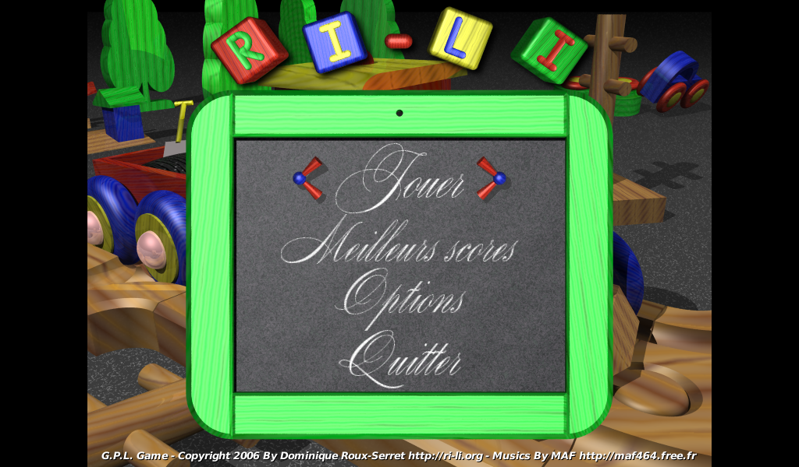
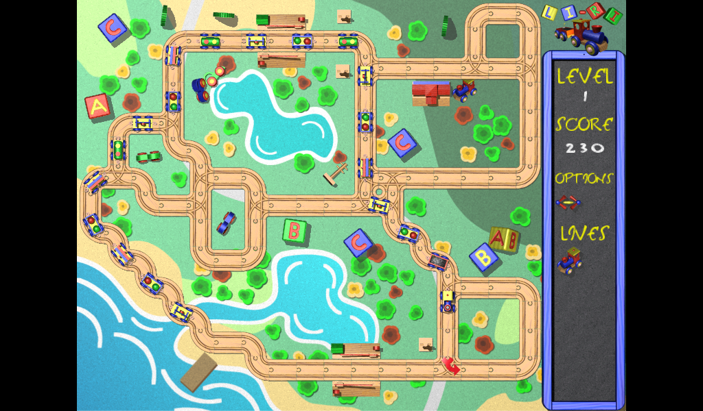

# Li-Ri is a GPL arcade game about toy wooden train
## Description
Li-Ri is a fork of Ri-li (http://www.ri-li.org).

Li-Ri is an arcade game licensed under the GPL (General Public License).
You drive a toy wooden train on many levels and you must collect all the wagons on map for win. This game is free, and is available on the following platforms: 'Windows', 'Linux', 'MacOS', 'Android'.

## Features
- 19 languages: Arabic, Breton, Chinese, English, Esperanto, French,
  German, Italian, Japanese, Korean, Portuguese, Russian, Slovak,
  Spanish, Swedish, Polish, Turkish, Hungarian, Dutch.
- Colorful animated wood engine.
- 50 levels in this first version
- 3 beautiful musics and many sound effects.

## Screenshots

Main menu

Gameplay

## Building
Information on how to compile Li-Ri is available in the INSTALL file

-------------

Copyright (c) 2023
Johnny Jazeix: port to SDL2 + android + cmake

Copyright (c) 2006
Dominique Roux-Serret: roux-serret@ifrance.com : design & programming & graphics & website.
Maf464 : musics

