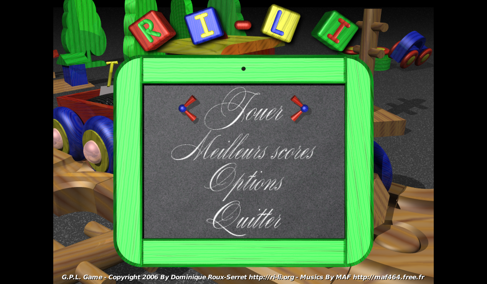
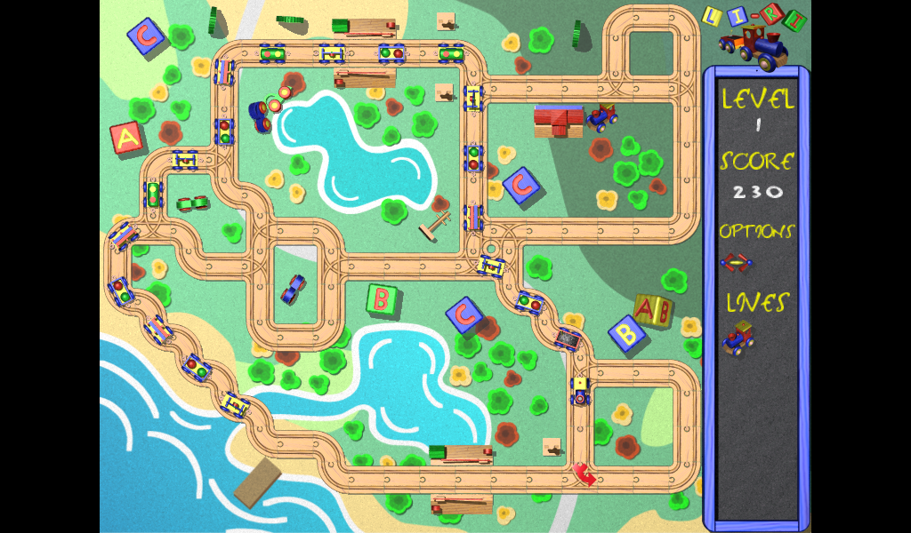

# Li-Ri is a GPL arcade game about toy wooden train
## Description
Li-Ri is a fork of Ri-li (http://www.ri-li.org).

Li-Ri is an arcade game licensed under the GPL (General Public License).
You drive a toy wooden train on many levels and you must collect all the wagons on map for win. This game is free, and is available on the following platforms: 'Windows', 'Linux', 'MacOS', 'Android'.

## Features
- 19 languages: Arabic, Breton, Chinese, English, Esperanto, French,
  German, Italian, Japanese, Korean, Portuguese, Russian, Slovak,
  Spanish, Swedish, Polish, Turkish, Hungarian, Dutch.
- Colorful animated wood engine.
- 50 levels in this first version.
- 2 themes with 3 beautiful pieces of music and many sound effects.

## Screenshots

Main menu

Gameplay

## Building
Information on how to compile Li-Ri is available in the INSTALL.md file.

## Thanks
* Christian H. and Adrian F. for the German correction.
* N. Y. for the Japanese corrections.
* David R. and David B.M. for the Spanish corrections.
* K. TONNELLE "http://ktonnelle.free.fr" for the Breton translation.
* V. Búr for the Esperanto translation.
* J. JORGE for the Portuguese translation.
* V. Búr for the Slovak translation.
* T. Gustavsson for the Swedish transltation.
* L. Serafinowski for the Polish translation.
* R. Claudio, Bao for Italian corrections.
* Mike for the russian corrections.
* F. Doruk "http://www.fisek.org.tr" for Turkish translation.
* S. Etienne for the Hungarian translation.
* W. Bas for Dutch translation.
* An, Sanggap for the Korean version and translation.
* M. Juhasz for the Hungarian corrections.

-------------

Copyright (c) 2023-2026
Johnny Jazeix: port to SDL2 + android + cmake

Copyright (c) 2026
Polishyk Mykyta "zabidentwfan@ukr.net": musics ("menu\_zabiden.ogg", "ingame1\_zabiden.ogg", "ingame2\_zabiden.ogg")

Copyright (c) 2006
Dominique Roux-Serret: design & programming & graphics & website.

Copyright (c) 2006 Maf464 (email charcosset.b@free.fr; website http://maf464.free.fr): ("menu\_maf.ogg", "ingame1\_maf.ogg", "ingame2\_maf.ogg")

